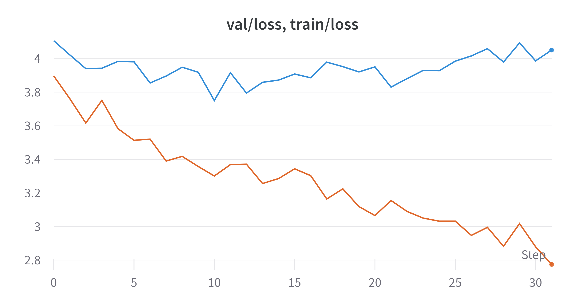
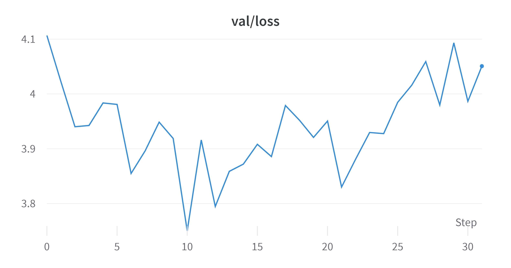

Finetuned GPT2 on the recent public anonymous conversations from Reddit to capture the genuine public sentiment regarding the recent unfolding events in Pakistan since last year. 

Hosted project link [here](https://huggingface.co/spaces/mnauf/redditGPT). Since this runs on CPU on huggingface free hosting, it takes about 500 seconds to respond. Alternatively, you can also run it on your GPU-enabled PC.

Download the model in the `model` directory from [here](https://drive.google.com/file/d/1bm4YT_SU8H6QzV8sn2yA38KhNNmbPyV4/view?usp=sharing)

Run `python sample.py` to generate the text. You can change the prompt by changing the `prompt` variable value in `sample.py`

### Dataset
For more details on the dataset generation, checkout the code in the `dataset_generation` directory.

### Training
To understand how finetuning works, please refer to Andrej Karpathy, [nanoGPT](https://github.com/karpathy/nanoGPT) project.

The loss for validation and training is attached.
#### Valid/Train Loss
Blue = Validation loss 

Orange = Training Loss

