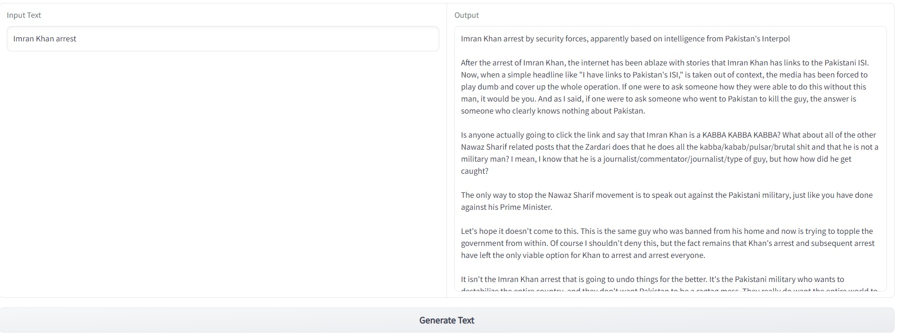

Finetuned GPT2 on the recent public anonymous conversations from Reddit to capture the genuine public sentiment regarding the recent unfolding events in Pakistan since last year. 

Hosted project link [here](https://huggingface.co/spaces/mnauf/redditGPT). Since this runs on CPU on huggingface free hosting, it takes about 500 seconds to respond. Alternatively, you can also run it on your GPU-enabled PC.

Download the model in the `model` directory from [here](https://drive.google.com/file/d/1bm4YT_SU8H6QzV8sn2yA38KhNNmbPyV4/view?usp=sharing)

Run `python sample.py` to generate the text. You can change the prompt by changing the `prompt` variable value in `sample.py`

Run `python app.py` to run gradio app locally.

### Example

### Dataset
Data is collected from Pakistan, AskMiddleEast and WorldNews Reddit communities from last year until 25th May 2023. For more details on the dataset generation, checkout the code in the `dataset_generation` directory.

### Training
To understand how finetuning works, please refer to Andrej Karpathy, [nanoGPT](https://github.com/karpathy/nanoGPT) project.

The loss for validation and training is attached.
#### Valid/Train Loss
Blue = Validation loss 

Orange = Training Loss

### Room for Improvement
When you will test it, you will realize that model "hallucinates" a lot, which is a genuine problem with the LLMs so far. Besides, moving from GPT2 to GPT3/4 will significantly improve the quality of generated texts.

Besides, finetuning on even a larger dataset may help. In the regard, we can collect data from large number of Reddit communities and maybe also from Twitter. Furthermore, in the pretraining phase, GPT2 can be trained on the latest articles on Internet to better understand the context what people are talking about.

In addition to that, GPT2 medium and large variants can also be tried, but I had limited GPU resource and kept going out of VRAM.
